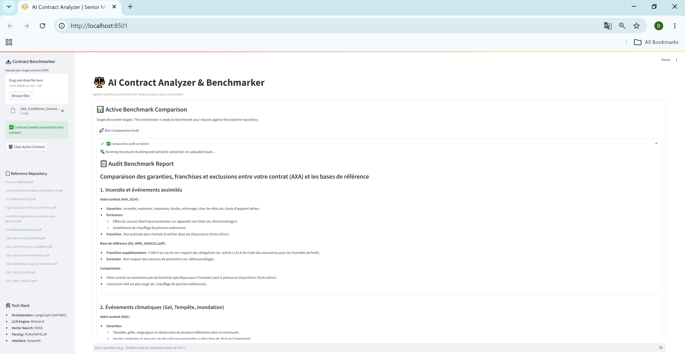
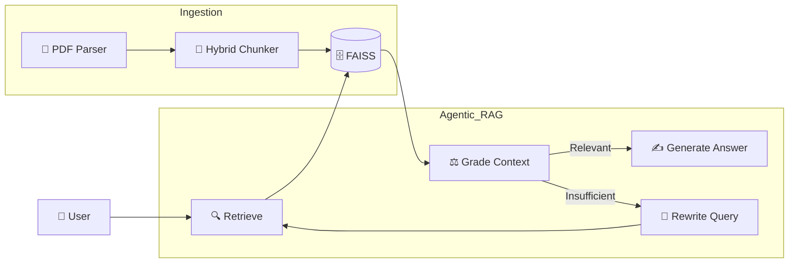

# ⚖️ AI Contract Analyzer

### Agentic Corrective RAG for Insurance Intelligence

## 📌 Overview

AI Contract Analyzer is an Agentic RAG system designed to analyze insurance contracts and answer complex legal questions using grounded contractual evidence.

The platform combines:

* semantic retrieval,
* corrective retrieval loops,
* legal document parsing,
* automated RAG evaluation.

The system is capable of:

* extracting guarantees, exclusions, deductibles, and indemnification ceilings,
* benchmarking contracts,
* reformulating failed retrieval queries automatically,
* reducing hallucinations through grounded generation.

---

# 🖥️ Application Preview



---
##  Architecture

### 🔹 Ingestion Pipeline

* PDF Parsing with `pymupdf4llm`
* Hybrid chunking:

  * `MarkdownHeaderTextSplitter`
  * `RecursiveCharacterTextSplitter`
* Embeddings:

  * `sentence-transformers/paraphrase-multilingual-MiniLM-L12-v2`
* Local vector database:

  * `FAISS`

---

### 🔹 Agentic Workflow

The orchestration is implemented with LangGraph.

```text
Retrieve → Grade → Rewrite → Retrieve → Generate
```

The system:

1. retrieves relevant contractual clauses,
2. grades retrieval quality,
3. rewrites the query if context is insufficient,
4. generates grounded responses with source traceability.

### LangGraph Orchestration Diagram



---

# 🚀 Key Features

| Feature                 | Description                                                    |
| ----------------------- | -------------------------------------------------------------- |
| Intelligent Contract QA | Extracts guarantees, exclusions, franchises, and legal clauses |
| Corrective RAG          | Automatically retries retrieval using rewritten queries        |
| Source Grounding        | Responses are generated from retrieved contractual evidence    |
| Local Vector Search     | FAISS-based sovereign semantic retrieval                       |
| RAG Evaluation          | Automated benchmarking with RAGAS                              |
| Streamlit Interface     | Interactive local application                                  |

---

# 📊 Evaluation Results (RAGAS)

Evaluation performed on insurance/legal use cases using:

* Faithfulness
* Answer Relevancy
* Context Precision
* Context Recall

# 🎯 Evaluation Results & Interpretation

| Metric             | Score  | Interpretation                                                        |
|------------------- |-------:|---------------------------------------------------------------------- |
| Faithfulness       | 0.7147 | Strong grounding with relatively low hallucination rate               |
| Answer Relevancy   | 0.3933 | Main improvement area due to retrieval misses and chunk fragmentation |
| Context Precision  | 0.5385 | Some semantic noise remains in retrieved chunks                       |
| Context Recall     | 0.6538 | Retriever retrieves relevant clauses in most cases                    |

---

# 🚀 Optimization Roadmap

| Improvement                     | Expected Benefit               |
| ------------------------------- | ------------------------------ |
| Hybrid Retrieval (BM25 + FAISS) | Better legal keyword matching  |
| Cross-Encoder Reranking         | Higher retrieval precision     |
| Parent-Child Retrieval          | Improved context completeness  |
| Metadata Filtering              | Better document targeting      |
| Rewrite Optimization            | More stable semantic retrieval |

---

# 🛠️ Tech Stack

| Layer           | Technology            |
| --------------- | --------------------- |
| Orchestration   | LangGraph             |
| LLM             | Mistral Large         |
| Embeddings      | Sentence Transformers |
| Vector Database | FAISS                 |
| Parsing         | pymupdf4llm           |
| Evaluation      | RAGAS                 |
| Frontend        | Streamlit             |

---

# ⚙️ Installation

## 1. Clone Repository

```bash
git clone https://github.com/diabarry/ai-contract-analyzer.git
cd ai-contract-analyzer
```

## 2. Create Environment

```bash
python -m venv .venv
```

Windows:

```bash
.venv\Scripts\activate
```

Linux/Mac:

```bash
source .venv/bin/activate
```

## 3. Install Dependencies

```bash
pip install --upgrade pip
pip install -r requirements.txt
```

---

# 🔐 Environment Variables

Create a `.env` file:

```bash
MISTRAL_API_KEY=your_mistral_api_key
HF_TOKEN=your_huggingface_token
```

---

# 📂 Build the Vector Index

Place your PDFs inside `/data` and run:

```bash
python main_ingestion.py
```

---

# ▶️ Launch Application

## Streamlit UI

```bash
streamlit run app.py
```

## RAG Evaluation

```bash
python -m eval.run_eval
```

---

# 👤 Author

**Diaraye BARRY**
Senior Data Scientist & Machine Learning Engineer

Expertise:

* LLM Systems
* Agentic RAG
* Retrieval Optimization
* MLOps
* Generative AI
